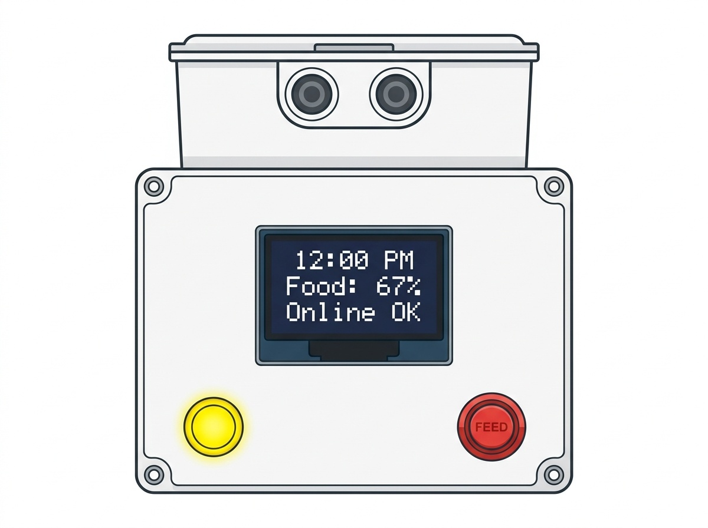
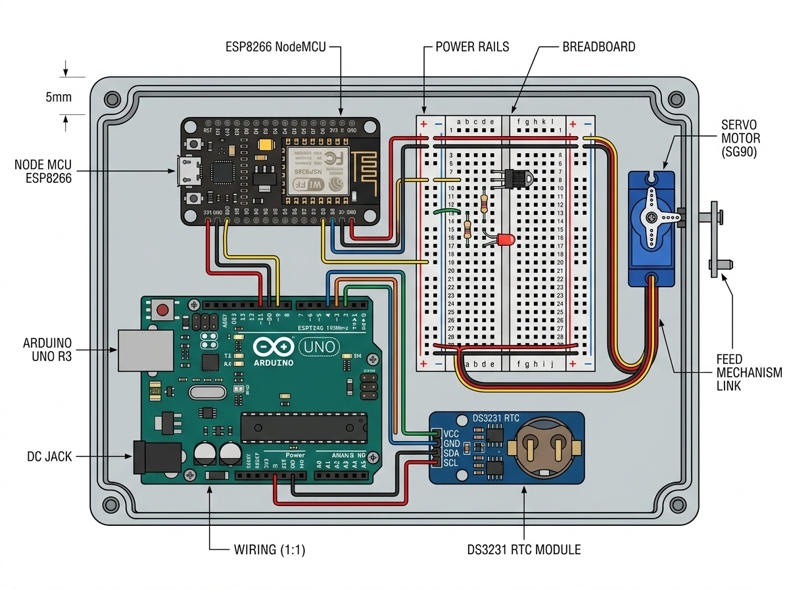
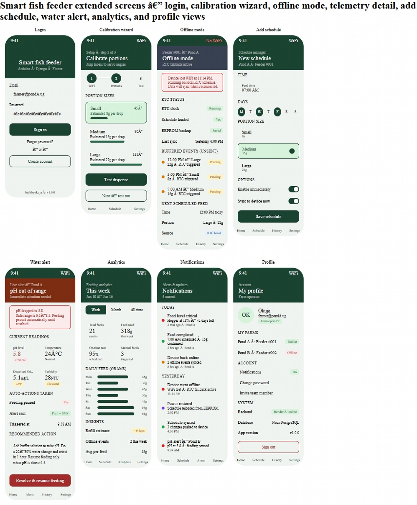
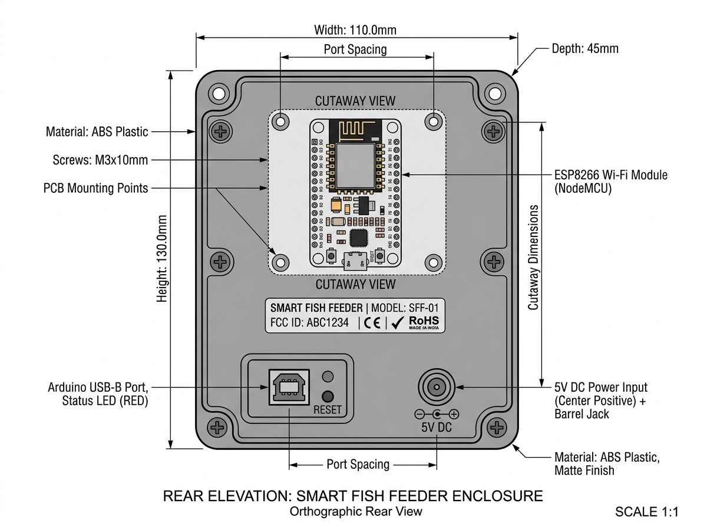
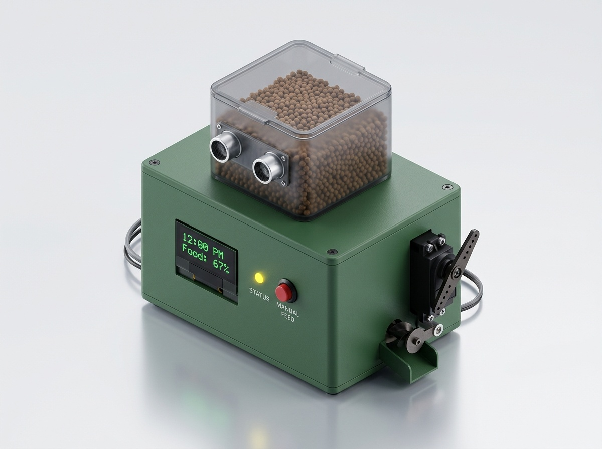
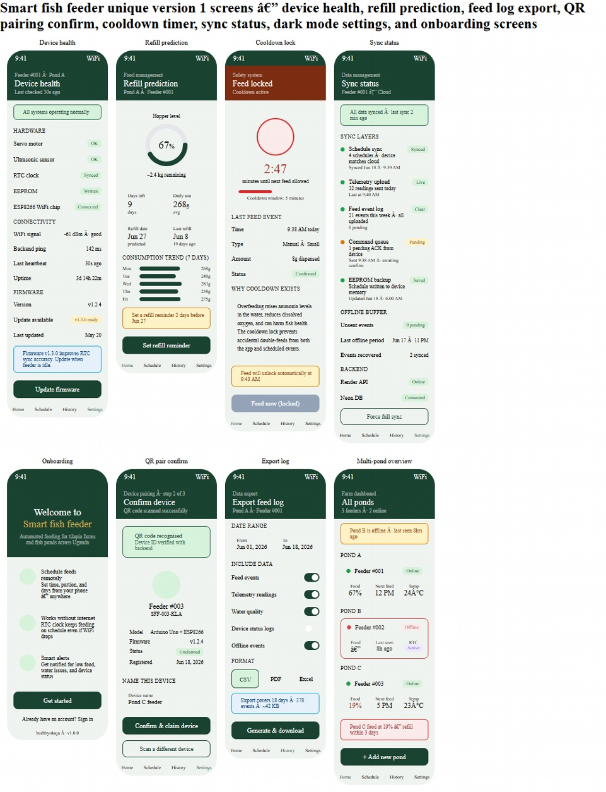
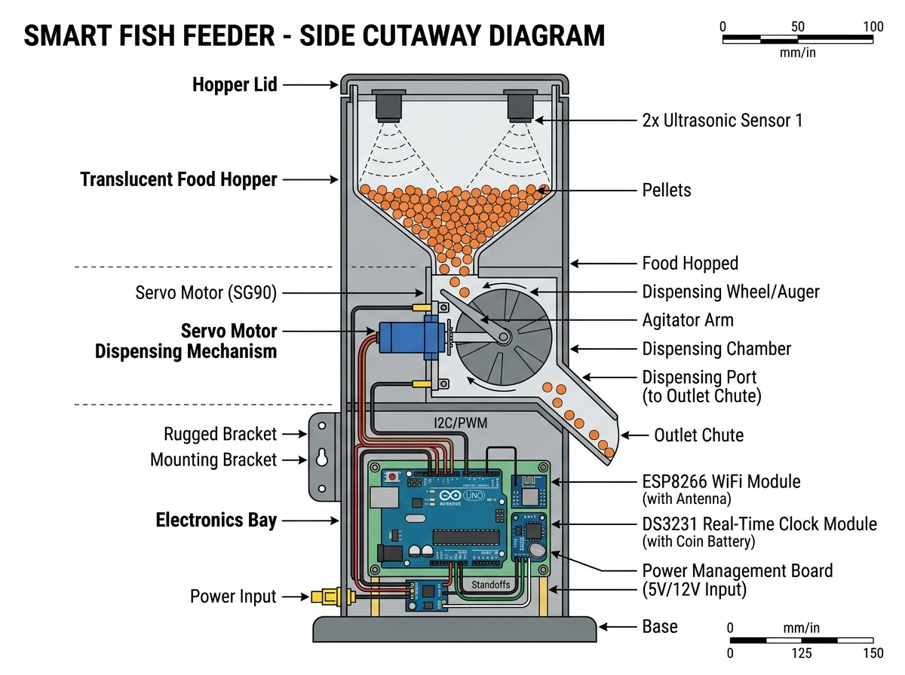

# 🐟 Smart Fish Feeder — Flutter Mobile App
### Group21 · Uganda Tilapia Aquaculture Platform

> Automated feeding for tilapia farms and fish ponds across Uganda.  
> Remote scheduling, RTC-backed offline operation, and multi-pond IoT management.

**Built for Ugandan Tilapia Aquaculture Farms**  
**GROUP21** · Makerere University · Kampala, Uganda

### Group Members

| Name | Student No. | Reg. No. |
|------|-------------|----------|
| MUTSINZI ALEX | 25/U/03480PS | 2500703480 |
| KAHUMA WALID | 25/U/26619 | 2500726619 |
| MUGABI ROBINSON | 25/U/03456/EVE | 2500703456 |
| NANFUUKA BONITAH | 25/U/03527/PS | 2500703527 |
| OKUJA EMMANUEL DILA JOHN | 25/U/28777/PSA | 2500728777 |

### Project Images









---

## 📱 App Screens

| # | Screen | Route | Description |
|---|--------|-------|-------------|
| 1 | Splash / Boot | `/` | Animated loader with hardware boot sequence |
| 2 | Onboarding | `/onboarding` | Welcome slides with feature highlights |
| 3 | QR Pairing | `/qr-pair` | Scan device QR sticker to pair feeder nodes |
| 4 | Dashboard | `Main → tab 0` | Active schedules, manual trigger, feed history |
| 5 | Multi-Pond | `Main → tab 1` | All ponds overview with live status cards |
| 6 | Refill Prediction | `Main → tab 2` | Ring gauge, consumption chart, refill alerts |
| 7 | Device Health | `Main → tab 3` | Hardware diagnostics, WiFi RSSI, firmware OTA |
| 8 | Cooldown Lock | `/cooldown` | Safety lock to prevent overfeeding |
| 9 | Sync Status | `/sync` | EEPROM memory + cloud sync counters |
| 10 | Export Log | `/export-log` | Export feed history as CSV / PDF / Excel |
| 11 | Menu / Directory | `Main → tab 4` | Full screen index with navigation |

---

## 🏗 Architecture

```
lib/
├── main.dart                  ← App entry point + route definitions
├── models/
│   └── models.dart            ← PondModel, FeedSchedule, FeedLog, DeviceInfo, SyncStatus
├── services/
│   └── app_state.dart         ← ChangeNotifier — global state for all screens
├── utils/
│   └── app_theme.dart         ← AppColors, AppTheme, AppTextStyles
├── widgets/
│   └── shared_widgets.dart    ← AppBottomNav, AppCard, AlertBanner, StatusBadge, DataRow
└── screens/
    ├── splash_screen.dart
    ├── onboarding_screen.dart
    ├── qr_pair_screen.dart
    ├── main_shell.dart         ← Bottom nav shell (IndexedStack)
    ├── dashboard_screen.dart
    ├── multi_pond_screen.dart
    ├── refill_prediction_screen.dart
    ├── device_health_screen.dart
    └── extra_screens.dart      ← CooldownLock, SyncStatus, ExportLog, MenuScreen
```

**State management:** Provider (`ChangeNotifier`)  
**Navigation:** Named routes + `IndexedStack` shell for bottom nav tabs

---

## 🔧 Hardware Integration (IoT)

This app is designed to communicate with:

| Component | Purpose |
|-----------|---------|
| **Arduino Uno** | Main microcontroller — controls servo and reads sensors |
| **ESP8266 (NodeMCU)** | WiFi module — sends telemetry to REST backend |
| **DS3231 RTC** | Hardware clock — triggers feeds even without internet |
| **EEPROM** | Offline log storage — synced to cloud on reconnect |
| **Servo Motor** | Dispenses fish feed pellets via timed rotation |
| **Ultrasonic Sensor (HC-SR04)** | Measures hopper food level |

Device serial format: `SFF-00X-KLA` (Smart Fish Feeder, unit #, Kampala)

---

## 🚀 Getting Started

### Prerequisites
- Flutter SDK ≥ 3.0.0
- Android Studio / VS Code with Flutter extension
- Android emulator or physical device (Android 6.0+ / iOS 12+)

### Run the project

```bash
# Install dependencies
flutter pub get

# Run on connected device
flutter run

# Build release APK
flutter build apk --release

# Build for iOS
flutter build ios --release
```

### Environment setup

Copy `.env.example` to `.env` and configure:

```env
API_BASE_URL=https://your-backend.onrender.com/api/v1
```

---

## 🌐 Backend

This app pairs with a **Django REST Framework** backend deployed on Render.  
Backend endpoints (to integrate):

| Endpoint | Method | Description |
|----------|--------|-------------|
| `/api/v1/devices/` | GET | List all paired feeder devices |
| `/api/v1/schedules/` | GET/POST | Manage feed schedules |
| `/api/v1/feed-logs/` | GET | Retrieve feed event history |
| `/api/v1/telemetry/` | POST | ESP8266 pushes sensor data |
| `/api/v1/sync/` | POST | EEPROM batch upload on reconnect |

---

## 🎨 Design System

| Token | Value |
|-------|-------|
| Primary | `#1A5C3A` (Deep forest green) |
| Accent | `#34D399` (Emerald mint) |
| Background | `#0F3623` (Dark jungle) |
| Surface | `#FFFFFF` |
| Warning | `#F59E0B` |
| Danger | `#EF4444` |

Typography: **Roboto** (system default) — clean and legible on Android

---

## 📦 Dependencies

| Package | Use |
|---------|-----|
| `provider` | State management |
| `http` | REST API calls |
| `shared_preferences` | Local settings persistence |
| `fl_chart` | Charts (upgrade from manual bars) |
| `intl` | Date/time formatting |
| `flutter_svg` | SVG logo assets |
| `percent_indicator` | Ring/linear progress gauges |

---

## 🗺 V1 → V2 Roadmap

### V1 (Current — this release)
- [x] All 10 core screens implemented
- [x] Provider state management
- [x] Local mock data (demo mode)
- [x] Manual feed trigger UI
- [x] Schedule CRUD
- [x] Refill prediction gauge
- [x] Device health + firmware OTA UI
- [x] Offline sync status screen
- [x] CSV/PDF/Excel export UI

### V2 (Planned)
- [ ] App settings screen to configure API base URL & token (available in Profile → API settings)
- [ ] CI workflow for automated tests (GitHub Actions included)

- [ ] Real API integration (Django backend)
- [ ] Push notifications (FCM) for low-food and offline alerts
- [ ] Computer Vision feed quality detection (camera + TFLite)
- [ ] Real QR scanner (mobile_scanner package)
- [ ] Multi-user farm roles (owner / worker / observer)
- [ ] Dark mode toggle
- [ ] Swahili / Luganda language support

---
